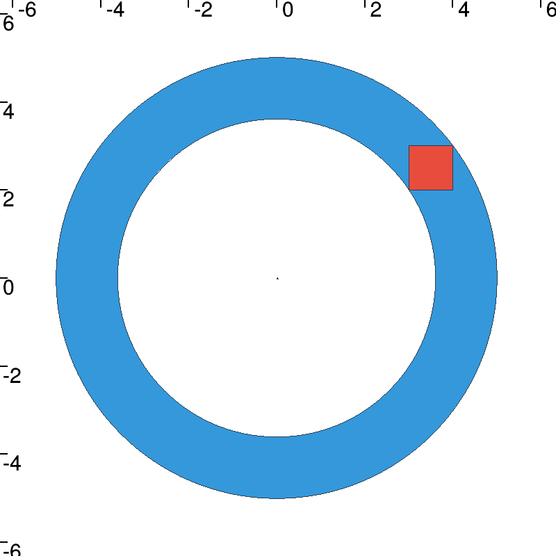
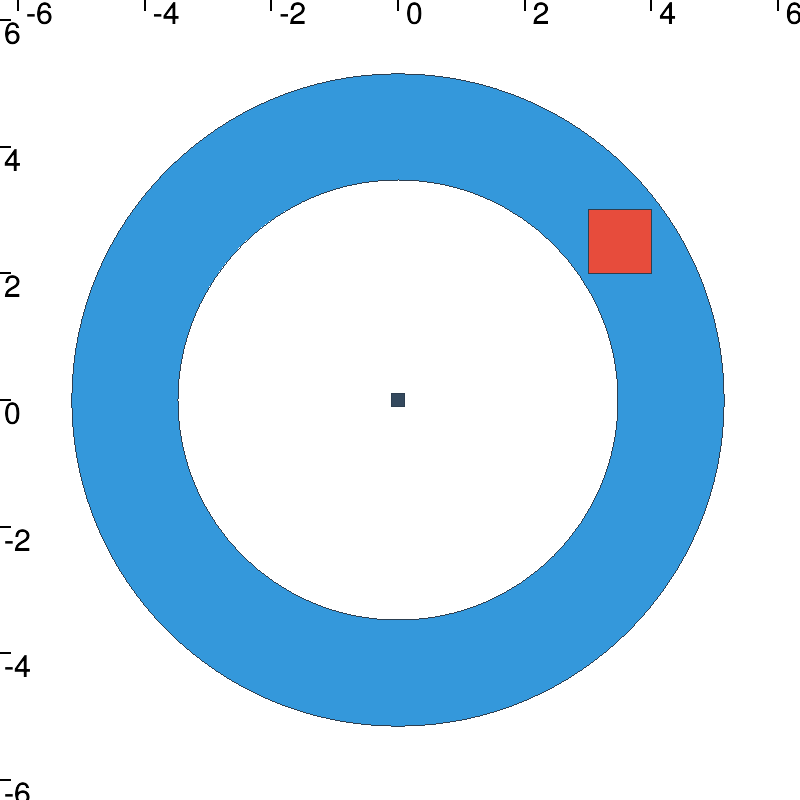
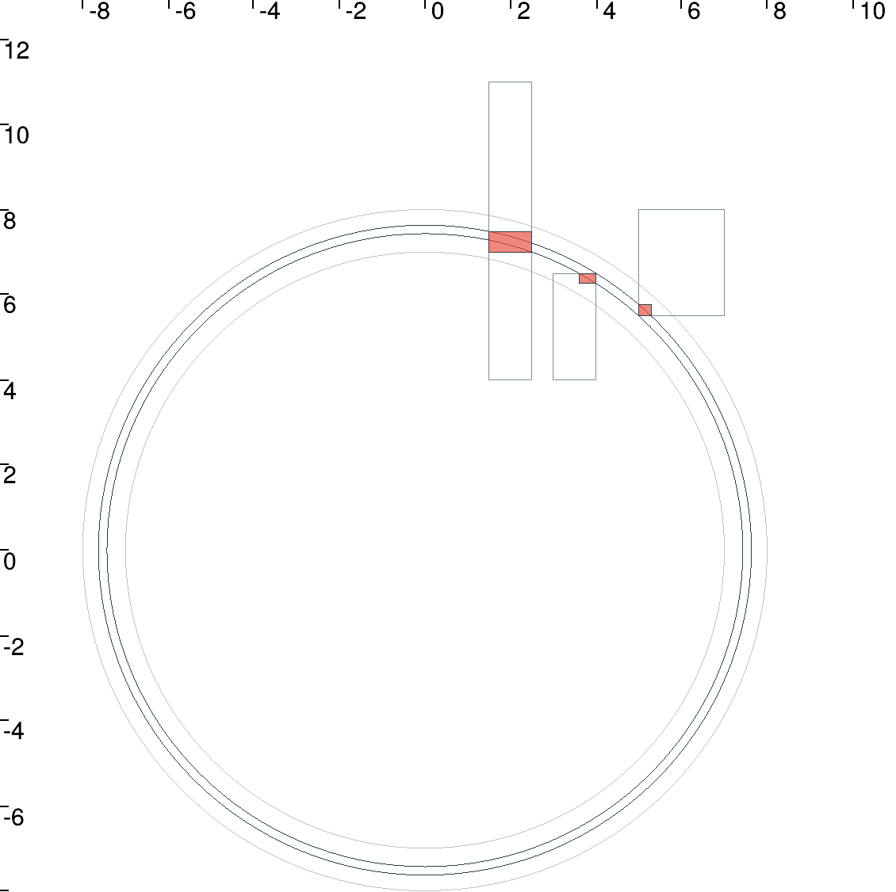

# Lesson_A : Getting started with intervals and contractors

## A1
Let us consider two intervals  and . Then .

## A2

The output of the programm is :

```bash
[-6, 12]
[-inf, -8]
[-2, 7]
[2, 9]
[empty]
[-1, 1]
[-0, 16]
[empty]
```

## A3
The output of the programm is :
```bash
([0, 3.141592653589794] ; [0, 0.5235987755982989])
```

## A4

We could see that the landmarks belong to the ring area, which is the goal of this question. With this contractor, we found every solutions at the considered distance of x = [0, 0]. Moreover, with a little incertainty on the robot's state, we get an extra incertainty on the ring, and it's also quite wider than before, but the landmarks always belongs to the area.

| *Ctc_dist* with landmark   | *Ctc_dist* with uncertainty|
|:--------------------------:|:--------------------------:|
|||

## A8

On the following figure, we could see that the box are contracted by the *ContractorNetwork* respecting to the distance from x condition.
