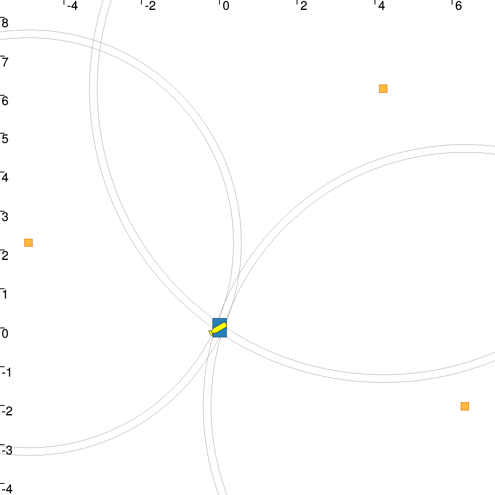

# Lesson_B : Static range-only localization

## B1

The program generate 3 random landmarks and their distance to the robot. We are then able to compute a box in which we are sure that the robot is inside.

