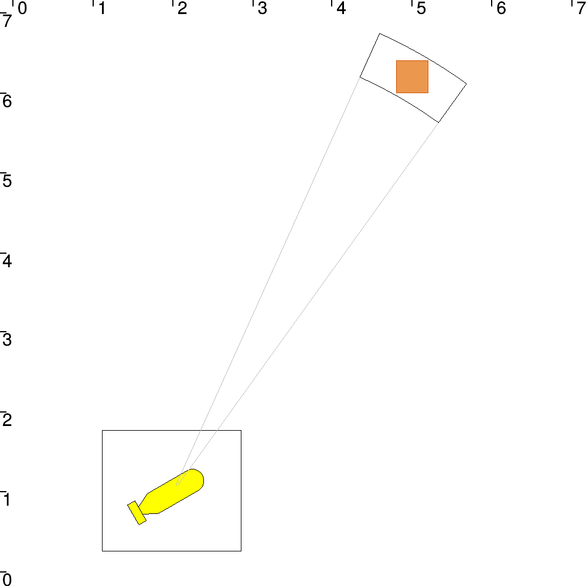

# Lesson C: Static range-and-bearing localization

## C1

Introducing the following constrains, we are able to solve this localization problem :
* \\%20\%20sin(\theta)\end{Bmatrix})
* 
* 
* 

## C9

We are able to estimate the state of the robot, with the contractor network implemented with the previous constrains.

