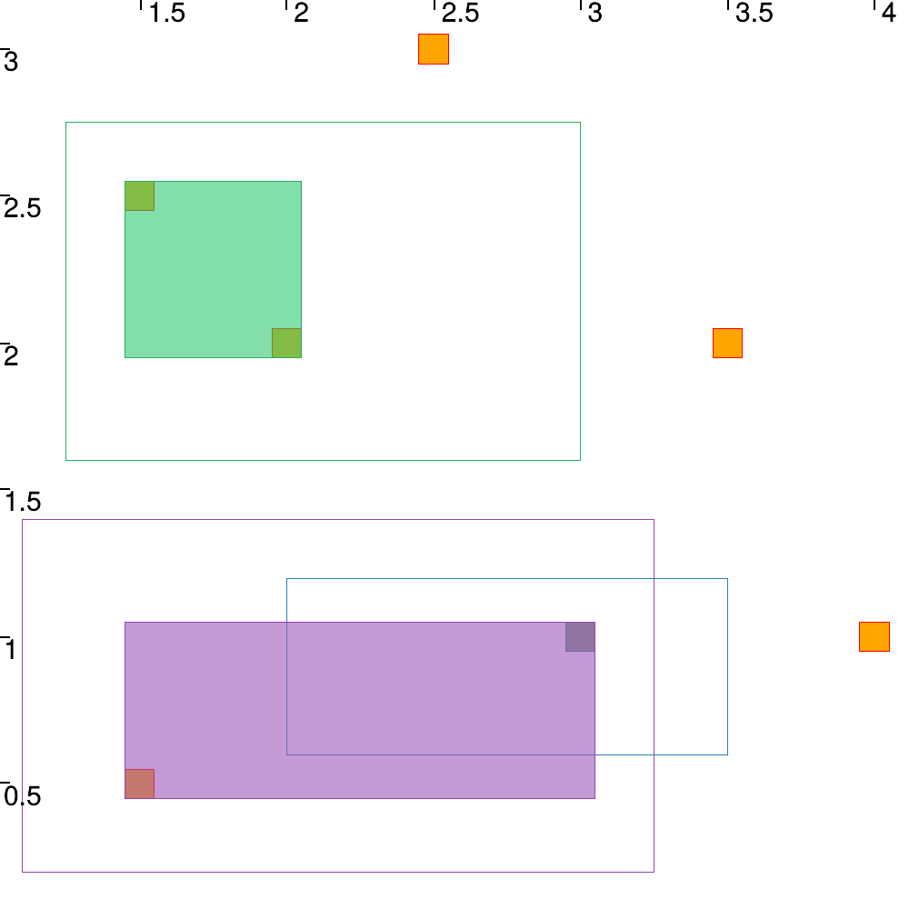
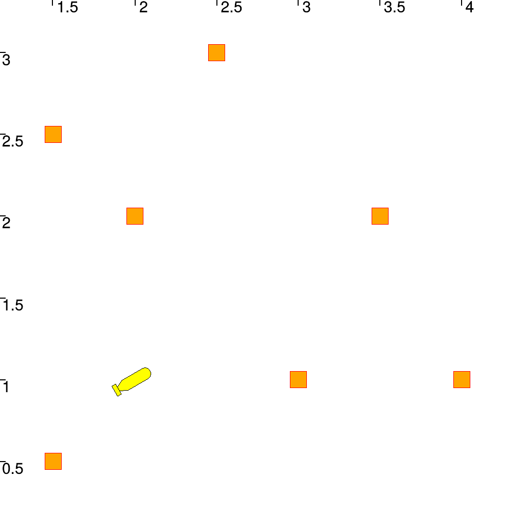
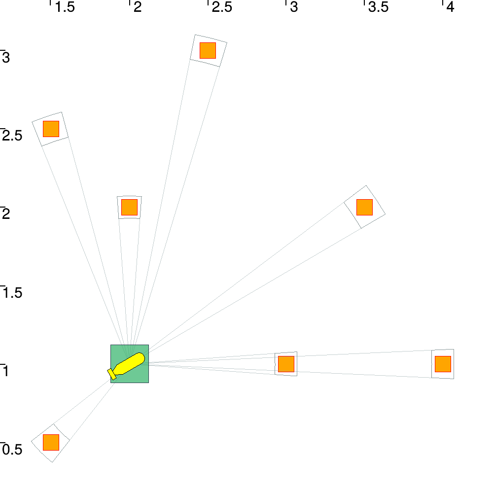
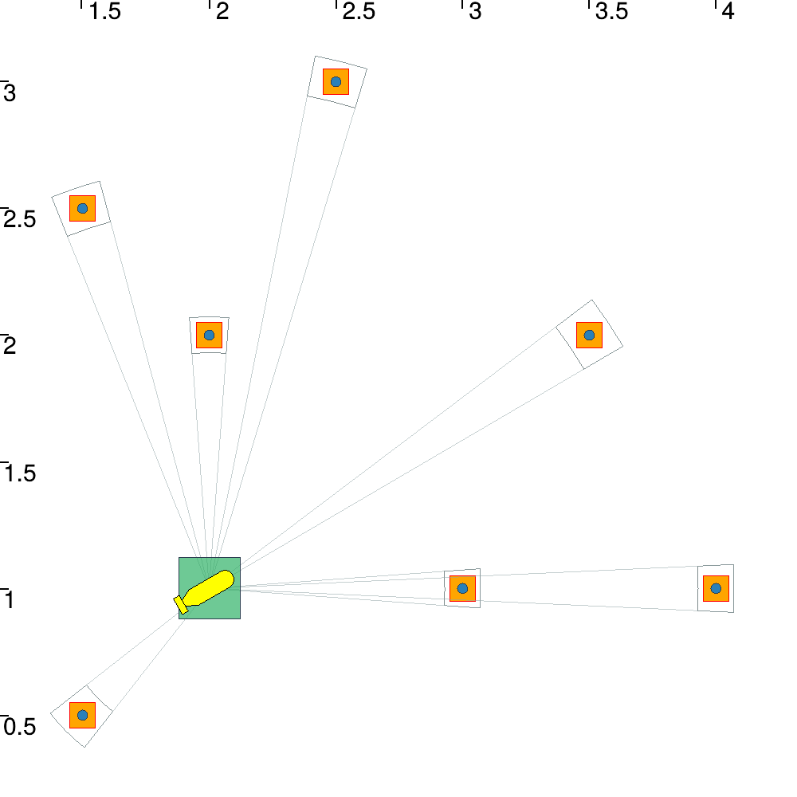

# Lesson D: Building our own contractor

## D3

Testing the implemented contractor with some data leads to the following result :

## D5

Here is the initialization of this localization problem.

## D8

Knowing the landmarks position, we are able to get the static localization of the robot without data association.

## D11

Adding the non-knowledge of the landmarks we are able to localize our robot with our association contractor.

