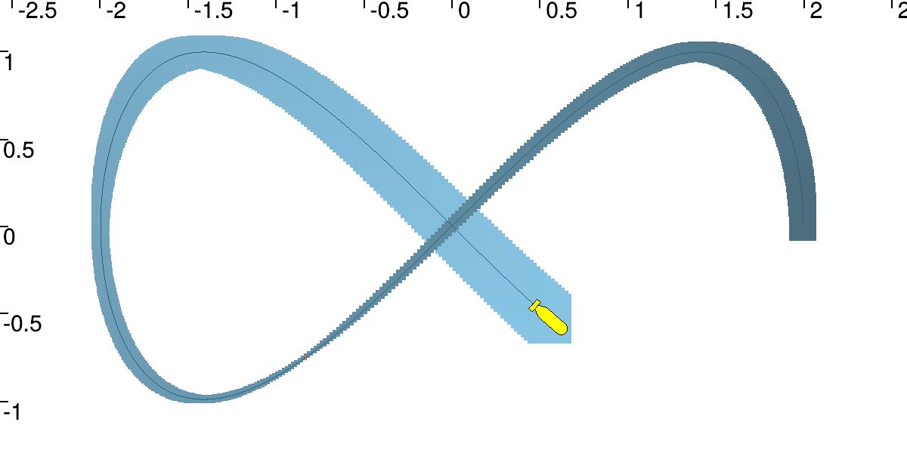
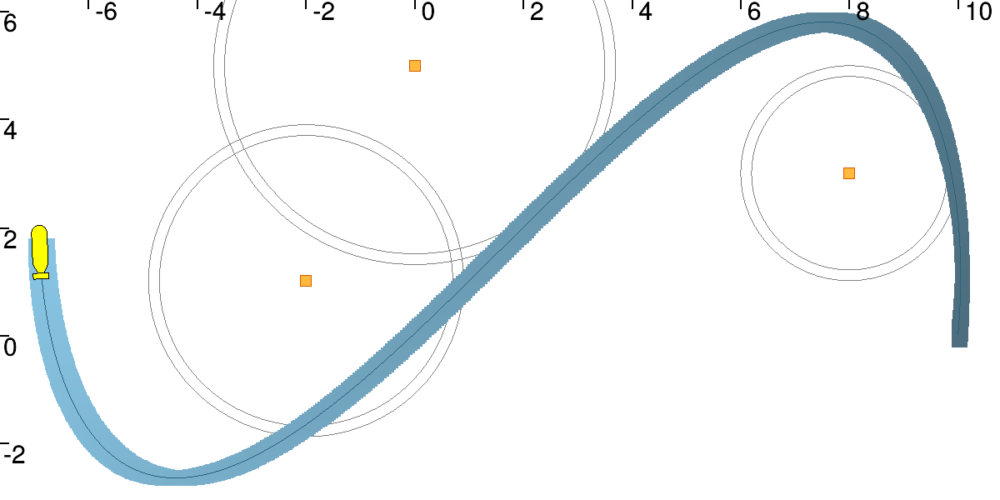

# Lesson F: Localization with asynchronous measurements

## F1 Contracting a Tube at a given time

Testing the implemented contractor with some data leads to the following result :

## F7 Dynamic range-only localization

The contractor is able to contract the tube containing the robot and to show us all the feasible trajectories :

