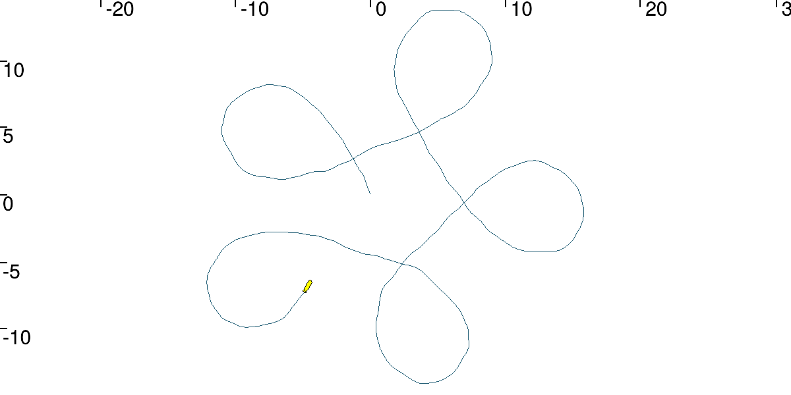
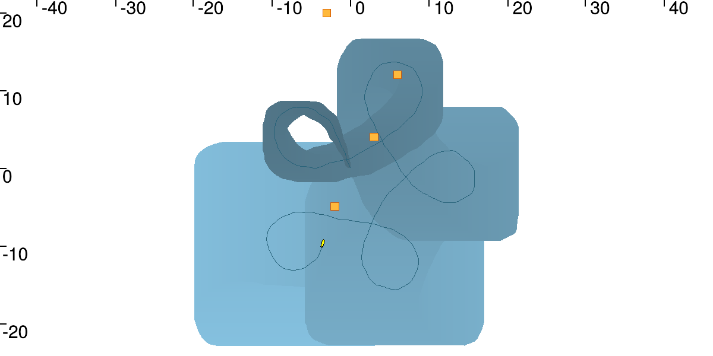
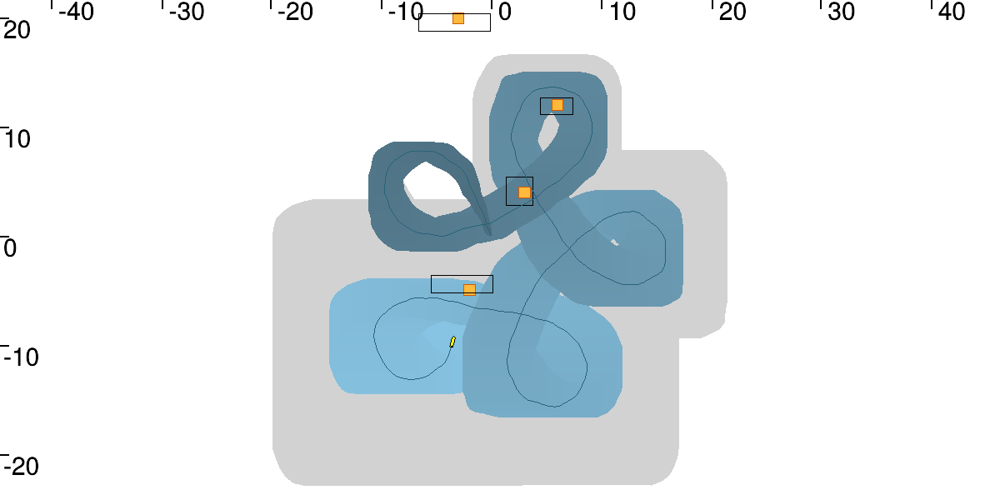

# Lesson H: Range-only SLAM

## H1

The simulation with noises give the following trajectory for the robot :

## H2

Dead reckoning is state estimation using only proprioceptive sensors like accelerometers and compass. Here we have a tube enclosing the trajectory with noisy mesurements. We could see that the tube is very large around the trajectory, and that the robot is quickly lost.

## H3

Adding 4 landmarks with unknown initial position, we are able to perform SLAM (Simultaneous Localisation and Mapping). Before contraction we have the dead reckoning tube enclosing the trajectory of the robot. After contracting we have a box bounding every landmark, and the tube wich is quite thinner than before.

| Before contraction | After contraction|
|:-:|:-:|
||
