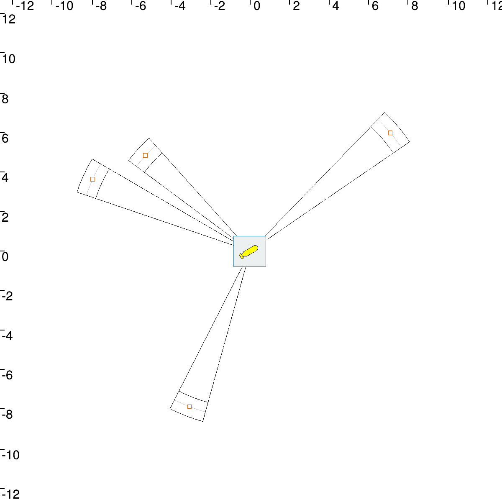
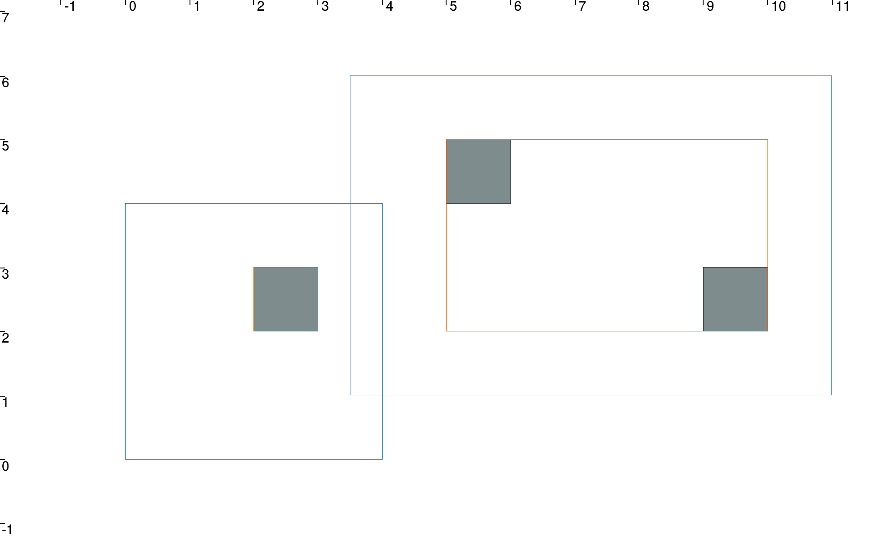

# Static state estimation

## Introduction
This program try to estimate the state of an AUV (*Autonomous Underwater Vehicle*) with 
range localization. It use Interval Analysis from the *ibex* library and *VIBes* in order
to display results.

## Build
 To build this program, run the following command in a terminal :
 ```bash
mkdir build
cd build
cmake ..
make 
```
Now you are able to launch the executable with 
```bash
./Static_Localization
```

## Example
Here is an example of output in *VIBes* we could have after a launch. The robot is displayed
at the center, the landmarks are displayed in orange and the estimated state of the robot
is displayed with the blue box.



## Association Contractor
In this project we need to build a contractor of association which contract boxes around
detected landmarks. An example of this Contractor is available in the *Association* executable.
It let us contract the blue boxes around landmarks represented in grey in order to get the
orange boxes in the following example.



## Built With

* [ibex-lib](https://github.com/ibex-team/ibex-lib) - Interval Analysis library
* [tubex-lib](https://github.com/SimonRohou/tubex-lib) - Tubex is a C++ library providing tools for computations over sets of trajectories
* [VIBes](https://github.com/ENSTABretagneRobotics/VIBES) - Visualizer for Intervals and Boxes 

## Authors

* **Brateau Quentin** - *Initial work* - [Teusner](https://github.com/Teusner) :sunglasses:

## License

This project is licensed under the GNU General Public License v3.0 - see the [LICENSE.md](LICENSE.md) file for details